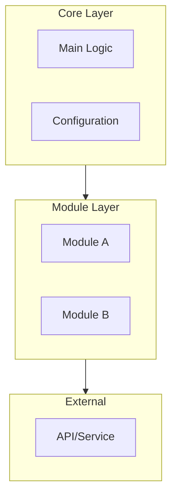
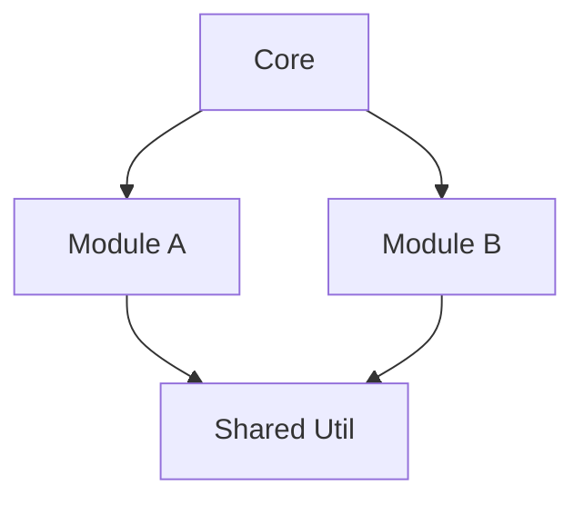
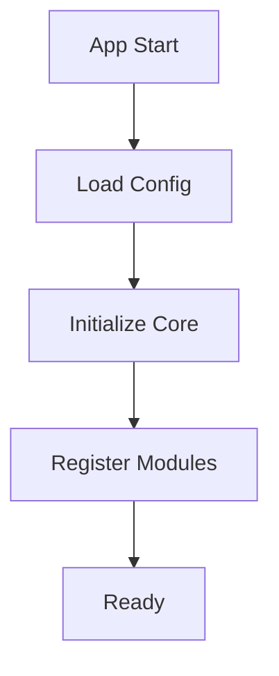

# Flowchart Generation Skill

코드베이스를 분석하여 시각적인 Mermaid 흐름도를 생성합니다.

## 트리거 키워드

- "흐름도", "flowchart", "다이어그램", "diagram"
- "아키텍처 그려", "구조도", "관계도"
- "데이터 흐름", "시퀀스", "플로우"

## 생성 가능한 다이어그램 타입

### 1. Architecture (아키텍처)
전체 시스템 레이어 구조를 보여줍니다.



### 2. Data Flow (데이터 흐름)
입력에서 출력까지의 데이터 흐름을 보여줍니다.


### 3. Module (모듈 관계)
모듈간 의존성과 통신을 보여줍니다.



### 4. Initialization (초기화 시퀀스)
시스템 시작 시 실행되는 순서를 보여줍니다.



## HTML 템플릿

```html
<!DOCTYPE html>
<html lang="ko">
<head>
    <meta charset="UTF-8">
    <title>{{ projectName }} - 흐름도</title>
    <script src="https://cdn.jsdelivr.net/npm/mermaid/dist/mermaid.min.js"></script>
    <style>
        body {
            font-family: 'Segoe UI', -apple-system, sans-serif;
            background: #1a1a2e;
            color: #e0e0e0;
            padding: 40px;
            margin: 0;
        }
        h1 { color: #4fc3f7; text-align: center; }
        h2 {
            color: #81c784;
            margin-top: 40px;
            border-bottom: 2px solid #81c784;
            padding-bottom: 10px;
        }
        .mermaid {
            background: #252542;
            padding: 20px;
            border-radius: 12px;
            margin: 20px 0;
        }
        .legend {
            background: rgba(255,255,255,0.05);
            padding: 20px;
            border-radius: 8px;
            margin: 20px 0;
        }
        .legend-item { margin: 8px 0; }
        .code { color: #4fc3f7; font-family: monospace; }
        .file { color: #ffb74d; font-family: monospace; }
    </style>
</head>
<body>
    <h1>{{ title }}</h1>

    <div class="legend">
        <strong>범례:</strong>
        <div class="legend-item">🟦 파란색 = 입력 (Input)</div>
        <div class="legend-item">🟩 초록색 = 처리 (Process)</div>
        <div class="legend-item">🟧 주황색 = 출력 (Output)</div>
    </div>

    {{ diagrams }}

    <script>
        mermaid.initialize({
            startOnLoad: true,
            theme: 'dark',
            flowchart: {
                useMaxWidth: true,
                htmlLabels: true,
                curve: 'basis'
            }
        });
    </script>
</body>
</html>
```

## 스타일 가이드

### 색상 규칙
- **입력 노드**: `style X fill:#2196f3` (파란색)
- **처리 노드**: `style X fill:#4caf50` (초록색)
- **출력 노드**: `style X fill:#ff9800` (주황색)
- **에러/무시**: `style X fill:#666` (회색)
- **강조**: `style X fill:#e91e63` (분홍색)

### 노드 형태
- `[텍스트]` - 사각형 (기본)
- `{텍스트}` - 마름모 (조건/분기)
- `(텍스트)` - 둥근 사각형
- `([텍스트])` - 스타디움
- `[[텍스트]]` - 서브루틴
- `((텍스트))` - 원형

### 화살표
- `-->` - 실선 화살표
- `-.->` - 점선 화살표
- `==>` - 굵은 화살표
- `--텍스트-->` - 레이블 있는 화살표

## 사용 예시

사용자: "이 프로젝트 아키텍처 흐름도 만들어줘"

1. 코드베이스 분석 (Glob, Grep, Read 사용)
2. 레이어 구조 파악
3. Mermaid 코드 생성
4. HTML 파일로 저장 (docs/flowchart.html)
5. 브라우저에서 열기 명령 제공
